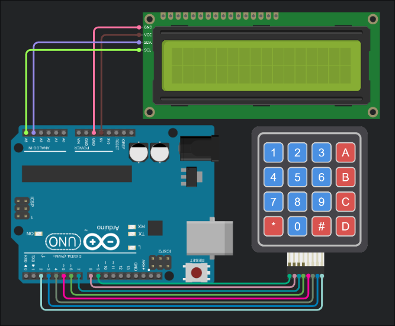

<h1>Pins</h1>

<h2>Keypad</h2>

|Keypad Pin|Digital Pin|
|----------|-----------|
|Row 1|9|
|Row 2|8|
|Row 3|7|
|Row 4|6|
|Col 1|5|
|Col 2|4|
|Col 3|3|
|Col 4|2|

<h2>LCD</h2>

|LCD Pin|Pin|
|-----|-----|
|GND|GND|
|VCC|5V|
|SDA|A4|
|SCL|A5|

<h1>Requirements:</h1>

<ul>
  <li>1x 4x4 Matrix Kaypad</li>
  <li>1x LCD</li>
  <li>1x Arduino UNO</li>
  <li>Jumper Cables</li>
</ul>

